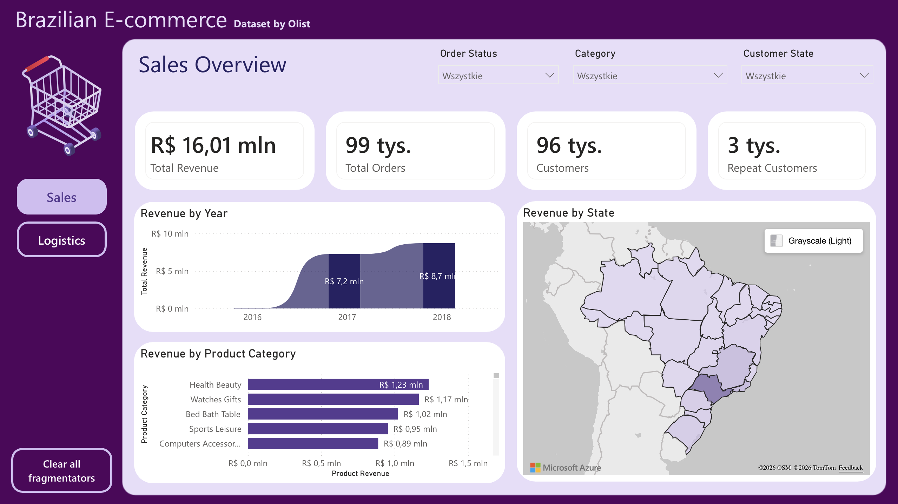
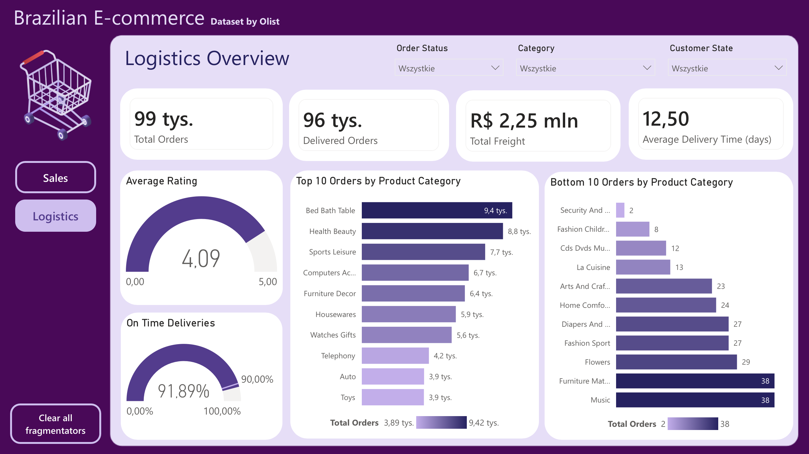
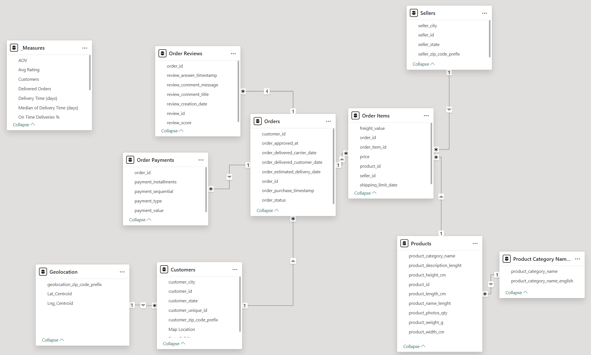

# Olist E-Commerce Analytics

**[Interactive Dashboard on Power BI Service](https://app.powerbi.com/view?r=eyJrIjoiOTI0ZDM2ODgtOTg5NC00MTFkLTllYjUtZTQ0ZDBmZWE2NzFlIiwidCI6IjgwYjEwMzNmLTIxZTAtNGE4Mi1iYmMwLWYwNWZkY2NkM2JjOCIsImMiOjl9)** | **[Dataset Source](https://www.kaggle.com/datasets/olistbr/brazilian-ecommerce)**

## Project Overview
This repository contains the documentation, configuration files, and the `.pbix` source file for an end-to-end data analytics project. The project processes the Brazilian E-Commerce Public Dataset by Olist, moving from raw data storage in a PostgreSQL database to an interactive Power BI dashboard. The objective is to monitor core e-commerce metrics such sales performance and logistics.

## Dashboard & Architecture Preview

### 1. Sales & Overview Page

*Displays financial KPIs, revenue distribution, and top-performing product categories.*

### 2. Logistics & Operations Page

*Focuses on delivery times, freight costs, and the geographical distribution of orders across Brazilian states.*

### 3. Data Model (Star Schema)

*Relational structure designed for optimal query rendering and DAX measure performance.*

## Data Pipeline

### 1. Extracting Data (PostgreSQL)
* **Data Ingestion:** Raw `.csv` files provided by Olist were imported and stored in a local PostgreSQL relational database.
* **Data Source Connection:** Power BI was connected directly to the PostgreSQL instance to extract the required tables.

### 2. Data Engineering & ETL (Power Query)
* **Data Cleaning:** Standardized text strings for product categories and formatted data types.
* **Missing Values Management:** Handled `NULL` categories without row deletion to maintain the integrity of global financial KPIs.
* **Referential Integrity:** Resolved missing key relationships to accurately map orphaned records in the product category translation table, and customers geoloacations.

### 3. Data Modeling
* Connected multiple Fact tables (Orders, Order Items, Payments) with Dimension tables (Products, Geolocation, Time).

### 4. DAX Calculations
* **Financials:** `Total Revenue`, `Average Order Value (AOV)`, and `Total Freight` (aggregated at the order-item level).
* **Logistics:** `On-Time Delivery Rate` comparing actual delivery timestamps against estimated delivery dates.

## Repository Structure
```text
brazilian-ecommerce-powerbi
 ┣ assets
 ┃ ┣ dashboard_preview_page_1.png    # Screenshot of Page 1 (Sales)
 ┃ ┣ dashboard_preview_page_2.png    # Screenshot of Page 2 (Logistics)
 ┃ ┣ background.png                  # Custom UI background
 ┃ ┣ Theme.json                      # Global color palette and typography settings
 ┃ ┗ model.png                       # Screenshot of the Star Schema
 ┣ Olist_Dashboard.pbix              # Main Power BI project file
 ┗ README.md                         # Project documentation
```
